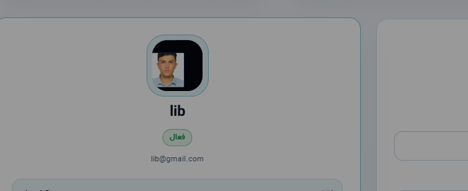

# Blade to Vue Migration Plan

This project is moving from Blade-heavy pages to a Vue-first frontend in small, safe phases.

## Architecture Rules

- Laravel keeps authentication, authorization, validation, database writes, reports, printable receipts, and APIs.
- Vue owns application screens, tables, filters, modal forms, alerts, and client-side state.
- Blade should eventually remain only for the Vue shell, auth pages if needed, print-only documents, and fallback server-rendered pages.
- Shared UI must live in reusable Vue components under `frontend/src/components`.
- Repeated HTTP logic must live in `frontend/src/services` or composables, not inside every page.
- Each migrated module should have one page component and smaller child components for forms, filters, tables, and summaries.

## Current Phase

Phase 1 creates a Vue SPA shell at `/app` without breaking existing Blade pages.

Completed in this phase:

- Added `/app` route for the Vue shell.
- Added `resources/views/app.blade.php` as a minimal mount file.
- Added `App\Support\FrontendNavigation` for centralized navigation data.
- Updated Vue Router to support the `/app` base path.
- Converted the first dashboard landing screen to Vue.

## Migration Order

1. Dashboard shell and shared layout.
2. Read-only list pages that already have API endpoints:
   - Dorm students
   - Dorm rooms
   - Library members
   - Library books
   - Library loans
   - Finance transactions
   - Users
3. Modal create/edit forms with API write endpoints.
4. Detail pages and profile pages.
5. Reports and exports.
6. Print pages, only if browser printing works better in Vue; otherwise keep Blade.

## API Work Needed

Some Blade forms still post directly to Laravel web routes. Before converting those screens fully, create JSON endpoints for:

- Store/update dorm students.
- Store/update rooms and room allocations.
- Store/update library members, books, loans, and finance records.
- Store/update admin users and finance transactions.
- Settings profile and password updates.

## Cleanup Rule

Do not delete a Blade page until the Vue version has:

- Same permissions.
- Same validation behavior.
- Same financial calculations.
- Same print/report links.
- Passing Laravel tests and successful Vite build.
